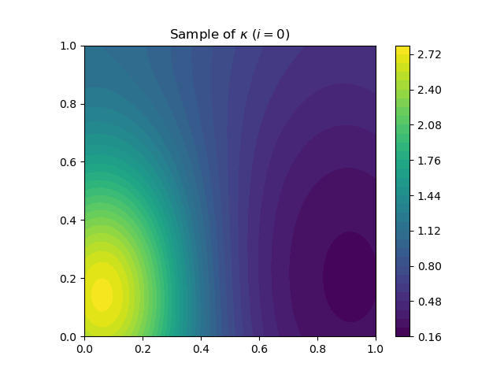

# Risk-neutral linear PDE-constrained optimization

The code can be used to solve the sample average approximation problem

$$
\min_{u\in U_{\text{ad}}} \frac{1}{2N} \sum_{i=1}^N \\|S(u,\xi^i)-y_d\\|\_{L^2(D)}^2 + \beta \\|u\\|\_{L^1(D)},
$$

where $\gamma \geq 0$ is regularization parameter, 
$D = (0,1)^2$ is the computational domain, 
$U_{\text{ad}} = \\{ u \in L^2(D) \colon -1 \leq u \leq 1\\}$ is the feasible set and 
$y_d \in L^2(D)$, and for each 
$(u,\xi) \in U\_{\text{ad}} \times \Xi$, 
$y(\xi) = S(u,\xi) \in H_0^1(D)$ solves

$$
\int_{D} \kappa(x,\xi) \nabla y(x)^T v(x) \text{d} x = \int_{D} u(x) v(x) \text{d}  x  \quad \text{for all} \quad v \in H_0^1(D).
$$

Here, $\kappa(x,\xi) > 0$for all $x \in \bar{D} \times \Xi$. 

## Samples of random inputs

The following animations show several realizations of the random field $\kappa$.

The animation can be generated using [plot_random_fields.sh](random_fields/plot_random_fields.sh).

## Nominal and reference solutions

The nominal solution (left) and reference SAA solution with $N=50$ (right). The nominal solution is the solution to 

$$
\min_{u\in U_{\text{ad}}} (1/2)\\|S(u,\mathbb{E}[\xi])-y_d\\|\_{L^2(D)}^2  + \beta \\|u\\|\_{L^1(D)}.
$$

