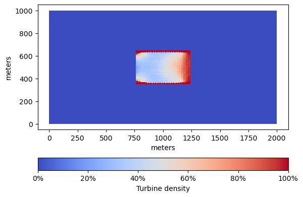
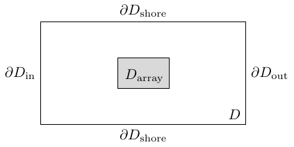

# Design optimization of tidal-stream energy farms

The code can be used to optimize the design of renewable tidal-stream energy farms
using the conditional gradient method. 

## Graphical illustrations

|:--:| 
*Optimal turbine density*

Using the conditional gradient method, we can compute a tidal-stream farm layout
which maximizes energy extraction. The setting used for this application is descriped
in Chapter 3 of the book [T. Schwedes, D.A. Ham, S.W. Funke, and M.D. Piggott](https://link.springer.com/book/10.1007/978-3-319-59483-5).

|:--:| 
*Variables of the 1D shallow water equations*

The figure illustrates the variables of the [shallow water equations](https://opentidalfarm.readthedocs.io/en/latest/examples/headland-optimization/headland-optimization.html).
Here, 
$y$ is the velocity, 
$\eta$ is the gree-surface displacement, 
$h$ is the water depth at rest, and
$H = \eta + h$ is the total water depth.

|:--:| 
*River segment*

The figure depicts the computational domain (river segment) and the potential
tidal turbine array domain.

## Implementation details

The optimization problem is taken from
Chapter 3 of the book [T. Schwedes, D.A. Ham, S.W. Funke, and M.D. Piggott](https://link.springer.com/book/10.1007/978-3-319-59483-5).
The implementation of the steady shallow water solver is based on
that used in [OpenTidalFarm](https://github.com/OpenTidalFarm/OpenTidalFarm/blob/master/opentidalfarm/solvers/coupled_sw_solver.py)
and [Code for Simulations in Chapter 3 of Researchbrief](https://zenodo.org/record/224251).

## Optimization problem

The objective is to maximize overall profit, which is given by the revenue minus the total installation and maintenance costs of the turbine farm. The revenue is proportional to the turbine farm total power. The ratio of revenue and total power equals the turbine's average lifetime times a turbine efficieny coefficient timesd the income factor. The total installation and maintenance costs is the sum of the installation and maintenance costs over all turbines. 

Instead of optimizing the number and positioning of potential turbines in the turbine farm, we are interested in obtaining a turbine density function. The turbine density function is proportional to the turbine friction, which we use as the control function.

The optimization problem is formulated as

$$
	\min_{u \in U_{\text{ad}}}  J(S(u),u) + \beta \\|u\\|_{L^1(D)},
$$

where $u$ on $D_{\text{array}}$ is the turbine friction, $\beta \geq 0$ is a cost parameter, $S(u)$ is the solution to steady state shallow water equations (see [eqns. (3.5) and (3.35)](https://link.springer.com/book/10.1007/978-3-319-59483-5)), and 
$U_{\text{ad}} = \\{ u \in L^2(D_{\text{array}}) : a \leq u \leq b \\}$ is the feasible set. Here $a = 0$
is the minimum turbine friction and $b \approx 0.059$ is the maximum turbine friction.

The turbine friction $c_t(d)$ is a nonnegative function of the turbine density function $d$ given by
(see [eq. (3.9)](https://link.springer.com/book/10.1007/978-3-319-59483-5))

$$
	c_t(d) = (1/2) C_t A_t d.
$$

Here $C_t = 0.6$ (dimensionless) is the thrust coefficient and $A_t$ (in square meter) is the turbine cross section. The term $(1/2) C_t A_t$ is the total amount of a turbine's friction (see [model_turbine.py](https://zenodo.org/record/224251)). The maximum turbine friction $b$ is obtained via

$$
  b = (1/2) C_t A_t/(\text{minimum turbine distance})^2,
$$

where $\text{minimum turbine distance} = 40$ (in meter) is the minimum distance between turbines. Hence the maximum turbine density is $\text{minimum turbine distance}^2 = 6.25 \cdot 10^{-4}$.

The turbine cross section $A_t$ is given by 

$$
	A_t = \pi \cdot (\text{blade radius})^2
$$

(see [model_turbine.py](https://zenodo.org/record/224251)). Here $\text{blade radius} = 10$.

Using these definitions, we obtain [$b \approx 0.059$](https://www.wolframalpha.com/input?i=0.6*pi*10%5E2*0.5%2F40%2F40).

We use $u=c_t(d)$, the turbine friction, as the control, not the turbine density $d$. 

The power function $J_{\text{power}}$ is defined by (see [eq. (3.10)](https://link.springer.com/book/10.1007/978-3-319-59483-5))

$$
 J_{\text{power}}(y, d) = \int_{D_\text{array}} \rho c_t(d(x)) \|y(x)\|_2^3 \mathrm{d} x
$$

where $\rho$ is the water density. See also [power_functionals.py](https://github.com/OpenTidalFarm/OpenTidalFarm/blob/master/opentidalfarm/functionals/power_functionals.py) and [steady_sw.py](https://github.com/OpenTidalFarm/OpenTidalFarm/blob/ca1aa59ee17818dc3b1ab94a9cbc735527fb2961/opentidalfarm/problems/steady_sw.py#L60).

The profit $J_{\text{profit}}$ to be maximized is defined by (see [eq. (3.11)](https://link.springer.com/book/10.1007/978-3-319-59483-5))

$$
	J_{\text{profit}}(y, d) = \text{revenue}(y, d) - \text{cost}(u)  = I \cdot k \cdot T \cdot J_{\text{power}}(y, d) - C \int_{D} d(x) \mathrm{d} x,
$$

where $T$ is a turbine's average lifetime, $k \in (0,1)$ is a turbine efficiency coefficient, $I$ is an income factor, and $C$ is the cost of installing and maintaining one turbine. 

We obtain 

$$
	J(y,u) = - \int_{D_\text{array}} \rho u(x) \|y(x)\|_2^3 \mathrm{d} x
$$

We use [$\beta = 4800$](https://www.wolframalpha.com/input?i=1*%281-0.4%29*1000*2%5E3) (see [cost_coefficient in model_turbine.py](https://zenodo.org/record/224251)).

The farm site's area is [150000 m^2](https://www.wolframalpha.com/input?i=%28650-350%29*%281250-750%29).

## Simulation output

## References

Alnæs, M. S., J Blechta, J. Hake, A Johansson, B Kehlet, A. Logg, C
Richardson, J Ring, M. E Rognes, and G. N. Wells. 2015. “The FEniCS
Project Version 1.5.” *Arch. Numer. Software* 3 (100): 9–23.
<https://doi.org/10.11588/ans.2015.100.20553>.

Funke, S. W., P. E. Farrell, and M. D. Piggott. 2014. “Tidal Turbine
Array Optimisation Using the Adjoint Approach.” *Renewable Energy* 63:
658–73. <https://doi.org/10.1016/j.renene.2013.09.031>.

Funke, S. W., S. C. Kramer, and M. D. Piggott. 2016. “Design
Optimisation and Resource Assessment for Tidal-Stream Renewable Energy
Farms Using a New Continuous Turbine Approach.” *Renew. Energ.* 99:
1046–61. <https://doi.org/10.1016/j.renene.2016.07.039>.

Mitusch, Sebastian K., Simon W. Funke, and Jørgen S. Dokken. 2019.
“Dolfin-Adjoint 2018.1: Automated Adjoints for FEniCS and Firedrake.”
*J. Open Source Softw.* 4 (38): 1292.
<https://doi.org/10.21105/joss.01292>.

Nordaas, Magne, and Simon W. Funke. 2016. “The Moola Optimisation
Package.” <https://github.com/funsim/moola>.

Piggott, Matthew D., Stephan C. Kramer, Simon W. Funke, David M. Culley,
and Athanasios Angeloudis. 2022. “8.10 - Optimization of Marine
Renewable Energy Systems.” In *Comprehensive Renewable Energy*, edited
by Trevor M. Letcher, 2nd ed., 8:176–220. Oxford: Elsevier.
<https://doi.org/10.1016/b978-0-12-819727-1.00179-5>.

Schwedes, Tobias, David A. Ham, Simon W. Funke, and Matthew D. Piggott.
2017. *Mesh Dependence in PDE-Constrained Optimisation*. SpringerBriefs
Math. Planet Earth. Cham: Springer.
<https://doi.org/10.1007/978-3-319-59483-5>.

Schwedes, Tobias, David Ham, and Simon Wolfgang Funke. 2016. *Code for
Simulations in Chapter 3 of Researchbrief*. Zenodo.
<https://doi.org/10.5281/zenodo.224251>.

