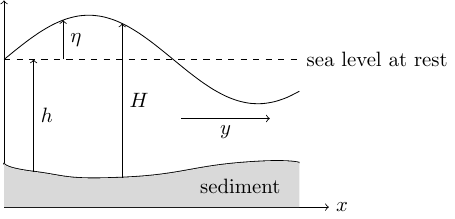

# Design optimization of tidal-stream energy farms

The code can be used to optimize the design of renewable tidal-stream energy farms
using the conditional gradient method. 

## Graphical illustrations

|:--:| 
*Optimal turbine density*

Using the conditional gradient method, we can compute a tidal-stream farm layout
which maximizes energy extraction. The setting used for this application is descriped
in Chapter 3 of the book [T. Schwedes, D.A. Ham, S.W. Funke, and M.D. Piggott](https://link.springer.com/book/10.1007/978-3-319-59483-5).

|:--:| 
*Variables of the 1D shallow water equations*

The figure illustrates the variables of the [shallow water equations](https://opentidalfarm.readthedocs.io/en/latest/examples/headland-optimization/headland-optimization.html).
Here, 
$y$ is the velocity, 
$eta$ is the gree-surface displacement, 
$h$ is the water depth at rest, and
$H = \eta + h$ is the total water depth.

|:--:| 
*River segment*

The figure depicts the computational domain (river segment) and the potential
tidal turbine array domain.

## Implementation details

The optimization problem is taken from
Chapter 3 of the book [T. Schwedes, D.A. Ham, S.W. Funke, and M.D. Piggott](https://link.springer.com/book/10.1007/978-3-319-59483-5).
The implementation of the steady shallow water solver is based on
that used in [OpenTidalFarm](https://github.com/OpenTidalFarm/OpenTidalFarm/blob/master/opentidalfarm/solvers/coupled_sw_solver.py)
and [Code for Simulations in Chapter 3 of Researchbrief](https://zenodo.org/record/224251).

## References

Alnæs, M. S., J Blechta, J. Hake, A Johansson, B Kehlet, A. Logg, C
Richardson, J Ring, M. E Rognes, and G. N. Wells. 2015. “The FEniCS
Project Version 1.5.” *Arch. Numer. Software* 3 (100): 9–23.
<https://doi.org/10.11588/ans.2015.100.20553>.

Funke, S. W., P. E. Farrell, and M. D. Piggott. 2014. “Tidal Turbine
Array Optimisation Using the Adjoint Approach.” *Renewable Energy* 63:
658–73. <https://doi.org/10.1016/j.renene.2013.09.031>.

Funke, S. W., S. C. Kramer, and M. D. Piggott. 2016. “Design
Optimisation and Resource Assessment for Tidal-Stream Renewable Energy
Farms Using a New Continuous Turbine Approach.” *Renew. Energ.* 99:
1046–61. <https://doi.org/10.1016/j.renene.2016.07.039>.

Mitusch, Sebastian K., Simon W. Funke, and Jørgen S. Dokken. 2019.
“Dolfin-Adjoint 2018.1: Automated Adjoints for FEniCS and Firedrake.”
*J. Open Source Softw.* 4 (38): 1292.
<https://doi.org/10.21105/joss.01292>.

Nordaas, Magne, and Simon W. Funke. 2016. “The Moola Optimisation
Package.” <https://github.com/funsim/moola>.

Piggott, Matthew D., Stephan C. Kramer, Simon W. Funke, David M. Culley,
and Athanasios Angeloudis. 2022. “8.10 - Optimization of Marine
Renewable Energy Systems.” In *Comprehensive Renewable Energy*, edited
by Trevor M. Letcher, 2nd ed., 8:176–220. Oxford: Elsevier.
<https://doi.org/10.1016/b978-0-12-819727-1.00179-5>.

Schwedes, Tobias, David A. Ham, Simon W. Funke, and Matthew D. Piggott.
2017. *Mesh Dependence in PDE-Constrained Optimisation*. SpringerBriefs
Math. Planet Earth. Cham: Springer.
<https://doi.org/10.1007/978-3-319-59483-5>.

Schwedes, Tobias, David Ham, and Simon Wolfgang Funke. 2016. *Code for
Simulations in Chapter 3 of Researchbrief*. Zenodo.
<https://doi.org/10.5281/zenodo.224251>.

